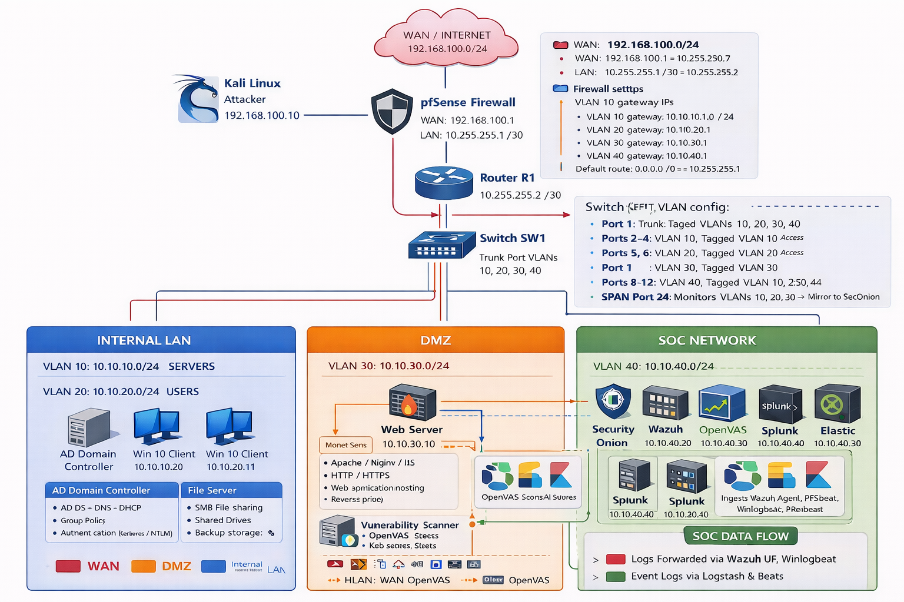

# Enterprise Cybersecurity Lab

This project simulates a **real enterprise cybersecurity environment** combining:

- Network engineering (CCNA concepts)
- SOC monitoring
- Threat detection
- Vulnerability management
- Attack simulation
- SIEM log analysis

The lab is built entirely with **virtual infrastructure** using:

- VMware / VirtualBox
- GNS3
- pfSense Firewall
- VLAN segmentation
- Active Directory
- Security Onion
- Wazuh
- Splunk
- Elastic Stack
- OpenVAS
- Kali Linux

---

# Lab Architecture

The environment simulates a segmented enterprise network with the following zones:

| Zone | Purpose |
|-----|------|
| WAN / Internet | External attacker network |
| DMZ | Public services |
| Internal LAN | Corporate users and servers |
| SOC Network | Security monitoring infrastructure |

---

# Network Segmentation

| VLAN | Network | Purpose |
|-----|------|------|
| VLAN 10 | 10.10.10.0/24 | Servers |
| VLAN 20 | 10.10.20.0/24 | Users |
| VLAN 30 | 10.10.30.0/24 | DMZ |
| VLAN 40 | 10.10.40.0/24 | SOC |

---

# Infrastructure Components

## Internal Network

### AD Domain Controller

Services:

- Active Directory Domain Services
- DNS
- DHCP
- Group Policy
- Kerberos / NTLM authentication

### File Server

Services:

- SMB file sharing
- Shared drives
- User home directories
- Backup storage

### Workstations

- Windows 10 domain joined clients
- Central authentication via Active Directory
- Log forwarding to SIEM

---

## DMZ

### Web Server

Services:

- Apache / Nginx / IIS
- HTTP / HTTPS
- Web application hosting
- Reverse proxy

---

## Vulnerability Management

### OpenVAS

OpenVAS performs vulnerability scanning for:

- missing patches
- misconfigurations
- vulnerable software
- known CVEs

---

## SOC Monitoring Stack

Security monitoring is performed using:

| Tool | Purpose |
|-----|------|
| Security Onion | Network detection and monitoring |
| Wazuh | Host intrusion detection |
| Splunk | SIEM log analysis |
| Elastic Stack | Log ingestion and analytics |

Logs are collected from:

- Windows event logs
- firewall logs
- network traffic
- authentication events
- attack simulations

---

# Attack Simulation

The lab includes simulated attacks using **Kali Linux**:

- Network reconnaissance
- Web scanning
- Password spraying
- Active Directory enumeration
- Credential dumping
- Lateral movement
- Malware simulation
- Data exfiltration

---

# Detection Engineering

Detections are implemented using:

- Sigma rules
- Splunk queries
- Elastic detection rules
- Wazuh custom rules
- Security Onion alerts

---

# Lab Architecture Diagram

See the architecture diagram here:

# Skills Demonstrated

This project demonstrates hands-on experience in:

- Enterprise network segmentation
- Firewall configuration
- VLAN design
- Active Directory administration
- SOC monitoring
- Threat detection
- Incident response
- SIEM engineering
- Vulnerability management
- Pentesting
