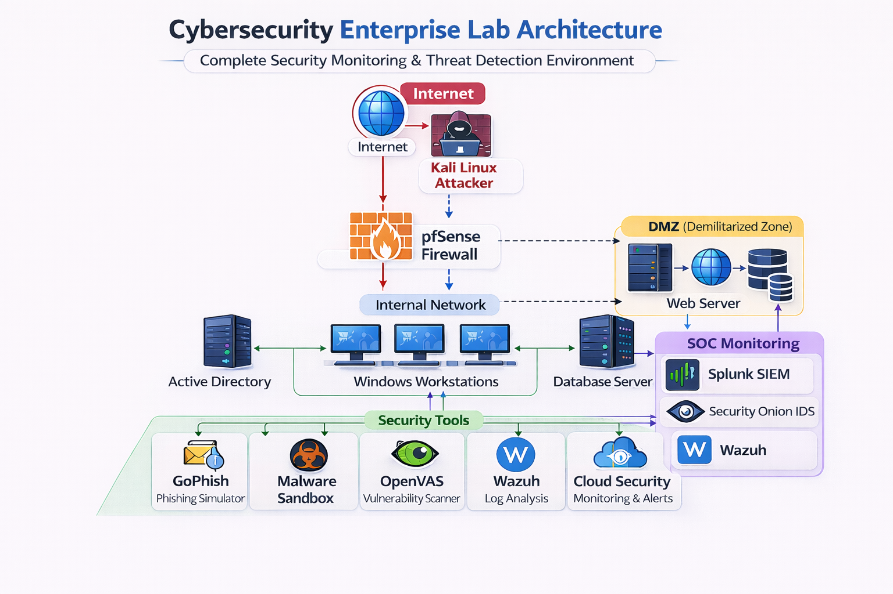

# Enterprise Cybersecurity Lab Architecture

This document describes the architecture of the enterprise cybersecurity lab.

## Architecture Diagram

.

## Network Components

- pfSense Firewall
- Active Directory Domain Controller
- Windows Workstations
- Kali Linux Attacker
- Security Onion IDS
- Splunk / Wazuh SIEM / Elastic stack
- DMZ Web Server
- Security tools (OpenVAS, GoPhish, Malware Sandbox)

## Network Zones

Internet → Firewall → Internal Network → DMZ

This lab simulates a real corporate security environment.
